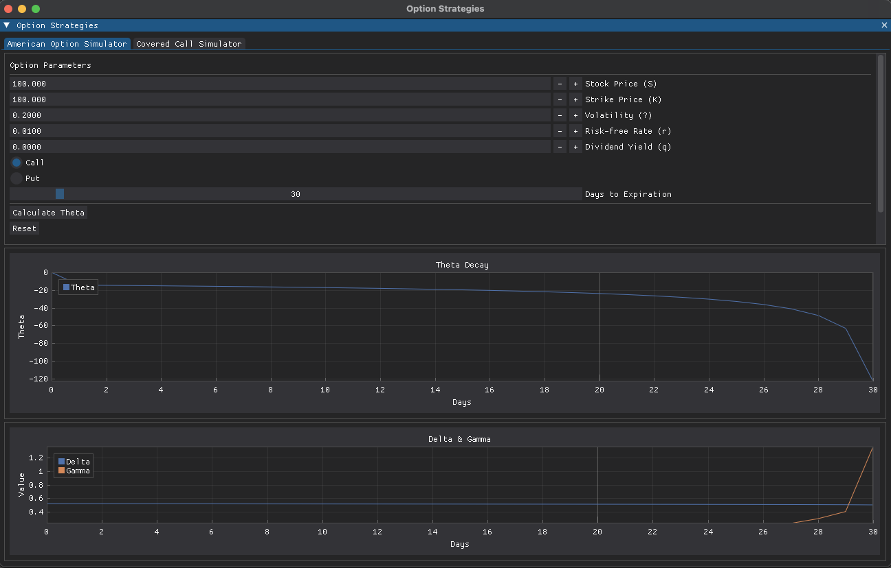
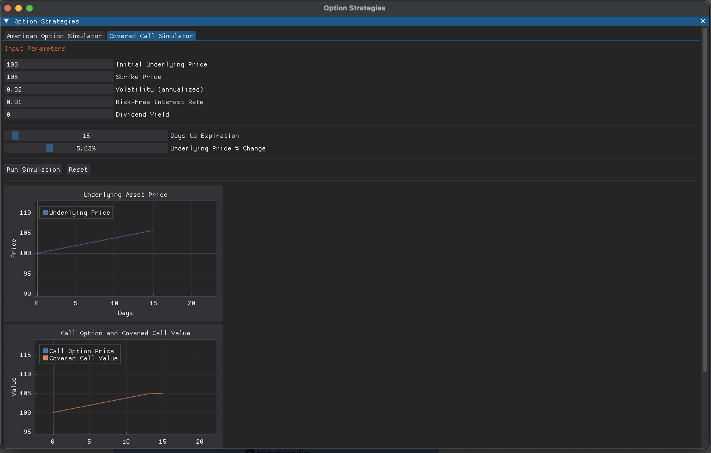

# README
### Write-up and Python Implementation by:
Michael Simmons

## Overview

This project has two main visualizations:

1. **American Option Theta Decay (Binomial Model)**  
2. **Covered Call Simulator (Black–Scholes Model)**

- American Options can be exercised before expiration, so it uses the uses a Cox-Ross-Rubinstein (CRR) Binomial Tree method to calculate the value, since it compares the continuing value and immediate exercise value of each time step. By using the binomial model, we can approximate each of the Greeks, which are then graphed in the program's GUI.


- The Covered Call visualizer uses the Black-Scholes formula that assumes the options are European-styled, so that a closed-form formula can be used to approximate the option's price depending on the time until expiration. By simulating the price path for each day from the intiial to final price, we can estimate how the value of the call option changes over time, and how the covered call strategy would perform in different market environments.

---

## GUI Screenshots



---
# Formulas Used

## American Option (Binomial Model)

### Cox-Ross-Rubinstein Steps

To price an American option, we will use a discrete binomial model (Cox-Ross-Rubinstein (CRR)). We split the time to expiry $T$ into $N$ steps; each of length $\Delta t = \frac{T}{N}$. 

1. **Up and Down Factors**  
   The CRR model assumes the underlying price can move up by a factor $u$ or down by a factor $d$ each step:
   $$
   u = e^{\sigma \sqrt{\Delta t}}, 
   \quad
   d = \frac{1}{u}
   $$
   where $\sigma$ is the annualized volatility.

2. **Risk-Neutral Probability**  
   To compute the option value as risk-neutral, we will use the formula:
   $$
   \tilde{p} = \frac{e^{(r - q)\Delta t} - d}{u - d}
   $$
   where
   - $r$ is the risk-free rate,
   - $q$ is the **continuous dividend yield**
     - (Both are annualized)
```
R_q = np.exp((r - q) * dt)
p = (R_q - d) / (u - d)
```

### Payoffs and Backward Induction

- At expiration ($t=T$), the payoff of a call is $\max(S_T - K, 0)$; for a put, $\max(K - S_T, 0)$.
- With this value, we can work backward through each time step $i = N-1, N-2, \dots, 0$ to compute the option value $V_{i,j}$ at each node:
  $$
  V_{i,j} = \max \Bigl\{ 
      \text{(immediate exercise value)}, 
      e^{-r \Delta t} \bigl[
         \tilde{p} \cdot V_{i+1,j+1} + (1 - \tilde{p}) \cdot V_{i+1,j}
      \bigr]
   \Bigr\}
  $$
  Because American options can be exercises before expiration, we take the max value here.
```
for i in reversed(range(N)):
    for j in range(i + 1):
        stock_price_ij = S * (u ** j) * (d ** (i - j))
        cont_value = (p * option_values[j + 1] + (1 - p) * option_values[j]) / np.exp(r * dt)
        if option_type.lower() == "call":
            exercise_value = max(0, stock_price_ij - K)
        else:
            exercise_value = max(0, K - stock_price_ij)
        option_values[j] = max(cont_value, exercise_value)

```

### Finite Difference Greeks

Other Greeks: Delta $(\Delta)$ and Gamma $(\Gamma)$ are also visualized using the finite differences method:
- **Delta**:
  $$
  \Delta \approx \frac{V(S + h) - V(S - h)}{2h}
  $$
- **Gamma**:
  $$
  \Gamma \approx \frac{V(S + h) - 2V(S) + V(S - h)}{h^2}
  $$
where $V(S)$ is the option price*computed at spot price $S$, and $h$ is a small increment.

Theta is handled day-to-day (for $N$ days), computing the difference in option prices over a 24 hour interval:
$$
\Theta \approx \frac{V(S, t+1) - V(S, t)}{\frac{1}{365}}
$$

```
h = 0.5
price_up = american_option_price_binomial(S + h, K, r, q, sigma, T, N, option_type)
price_down = american_option_price_binomial(S - h, K, r, q, sigma, T, N, option_type)
price_mid = american_option_price_binomial(S, K, r, q, sigma, T, N, option_type)

delta = (price_up - price_down) / (2.0 * h)
gamma = (price_up - 2.0 * price_mid + price_down) / (h ** 2)
```

---

## Black–Scholes Model for Covered Call

### Call Option Price

The Black–Scholes formula for a European call is:
$$
C(S, t) = S \, e^{-qT} \Phi(d_1) \;-\; K \, e^{-rT} \Phi(d_2),
$$
where $T$ is the time to maturity in years and $\Phi(\cdot)$ is the CDF of the standard normal distribution. The terms $d_1$ and $d_2$ are:
$$
d_1 = \frac{\ln \left(\frac{S}{K}\right) + \left(r - q + \frac{\sigma^2}{2}\right) T}{\sigma \sqrt{T}},
\quad
d_2 = d_1 - \sigma \sqrt{T}.
$$
```
d1 = (math.log(S / K) + (r - q + 0.5 * sigma ** 2) * T) / (sigma * math.sqrt(T))
d2 = d1 - sigma * math.sqrt(T)
call_price = (S * math.exp(-q * T) * _phi(d1)) - (K * math.exp(-r * T) * _phi(d2))
return call_price
```

### Black–Scholes Greeks

In the Covered Call code, we compute the main Greeks for the call:
- **Delta** $(\Delta)$:  
  $$
  \Delta = e^{-q T}\,\Phi(d_1)
  $$
- **Gamma** $(\Gamma)$:
  $$
  \Gamma = \frac{e^{-q T}}{S \, \sigma \sqrt{T}} \;\frac{1}{\sqrt{2\pi}} \, e^{-\frac{d_1^2}{2}}
  $$
- **Theta** $(\Theta)$, **Vega** $(\nu)$, **Rho** $(\rho)$ follow from the standard Black–Scholes method.
```
delta = math.exp(-q * T) * _phi(d1)
gamma = (math.exp(-q * T) / (S * sigma * math.sqrt(T))) \
        * (1 / math.sqrt(2 * math.pi)) \
        * math.exp(-0.5 * d1 ** 2)
```

### Covered Call Strategy

The net position value at any time is:
$$
\text{Covered Call} = S - C
$$
where $S$ is the underlying price and $C$ is the call option price.  

In our simulation, we assume the underlying moves from an initial price $S_0$ to a final price $S_0(1 + \text{pct\_change})$ linearly. Each day’s call price is computed using Black–Scholes, then subtracted from the underlying price to get the covered call's value.

--- 

## References & Sources

- https://xilinx.github.io/Vitis_Libraries/quantitative_finance/2021.1/methods/cf-ht.html
- https://www.macroption.com/cox-ross-rubinstein-formulas/
- https://www.investopedia.com/terms/r/risk-neutral-probabilities.asp
- https://en.wikipedia.org/wiki/Black–Scholes_model
- https://www.askpython.com/python/examples/black-scholes-model
- https://www.investopedia.com/terms/b/blackscholes.asp
